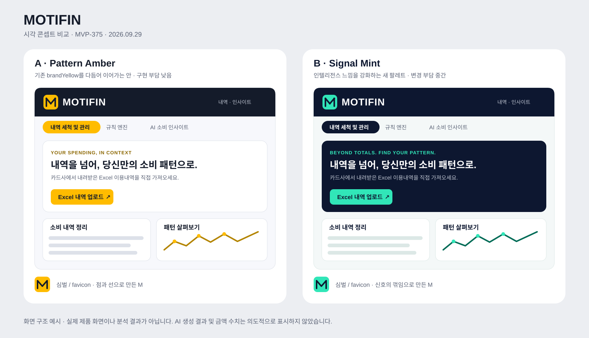
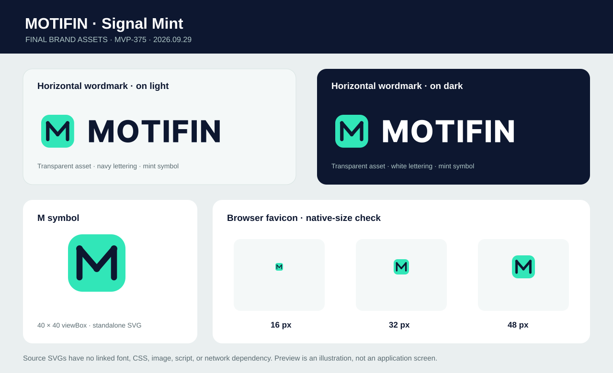

# MVP-375 · MOTIFIN 시각 콘셉트 비교

2026-09-29 · **PO 확정: B · Signal Mint** · 실제 서비스 적용은 MVP-362

**2026-09-30 최종 표현 기준:** 브랜드 선택·색상·공식 에셋은 그대로 유지한다. 현재 제품의 시각·인터랙션 적용은 [공통 Visual / Interaction Language](../design/mvp-364-365/shared-design.md)를 따른다. 아래 비교표·MVP-362 인계·현행 상태는 당시 결정/적용 이력이며 밝은 Mint를 CTA·제목·선택·데이터의 공통 최강 강조로 쓰라는 지시가 아니다. 현재 범위는 Light Only이고 어두운 Hero/로고용 에셋은 다크모드 지원과 별개다.

위 그림은 브랜드와 화면 구성의 적용 **도식**이다. 거래 금액, AI 결과, 미래 예측을 나타내는 실제 제품 캡처나 시연 데이터가 아니다.

## 결정할 사항

| | A · Pattern Amber | B · Signal Mint |
| --- | --- | --- |
| 인상 | 따뜻하고 정돈된 개인 소비 분석 | 선명하고 기술적인 개인 소비 인텔리전스 |
| MOTIF 표현 | 개별 점이 꺾인 선으로 이어져 M이 됨 | 같은 M을 신호처럼 더 날카롭게 표현 |
| 주색 | 기존 `brandYellow` `#FFBC00`, 잉크 `#141B2A` | 민트 `#31E6B8`, 네이비 `#0D1730` |
| 밝은 화면 배경 | `#F7F8FC`와 흰색 카드 | `#F4F8F8`와 흰색 카드 |
| 본문 서체 | 기존 Pretendard Variable 유지 | 기존 Pretendard Variable 유지 |
| 헤더·업로드 | 어두운 헤더, 노란 선택 상태와 업로드 CTA | 어두운 헤더와 강조 Hero, 민트 업로드 CTA |
| 추정 공수/위험 | 낮음: 기존 Mantine 팔레트 및 컴포넌트 재사용 | 중간: `brandYellow` 전역 참조와 밝은/어두운 화면 대조 확인 필요 |

**PO 결정: B · Signal Mint.** 개인 소비 인텔리전스의 기술적인 인상을 강화하기 위해 선택했다. 기존 노란색 직접 참조가 여러 화면에 있으므로 MVP-362는 헤더·Hero·주요 CTA·탭의 브랜드색을 우선 일관화하고, 상태색과 데이터색의 회귀를 확인한다. 마감에 맞춰 전체 UI 구조 개편은 하지 않는다. A는 비교 이력이며 구현 대상으로 인계하지 않는다.

## 확정된 브랜드 언어

- 공식 표기: **MOTIFIN** (한국어 문맥에서 모티핀 병기 가능). MOTIF + FINANCE.
- 영문 슬로건: **Beyond totals. Find your pattern.**
- 국문 메시지: **내역을 넘어, 당신만의 소비 패턴으로.**
- 업로드 설명: **카드사에서 내려받은 Excel 이용내역을 직접 가져오세요.** 자동 연동을 암시하지 않는다.
- AI 인사이트 생성 성공 화면이나 절감액 등은 실제 작동 및 실제 데이터가 확인될 때만 표시한다.

## 최종 브랜드 에셋 · MVP-362에서 그대로 사용

| 파일 (`docs/brand/` 기준) | 용도 · 적용 방식 |
| --- | --- |
| [`motifin-symbol.svg`](./motifin-symbol.svg) | 40×40 M 심벌 원본. 단독 아이콘과 좁은 화면의 로고 영역에 사용. |
| [`motifin-wordmark-on-light.svg`](./motifin-wordmark-on-light.svg) | 투명 배경, 민트 심벌 + 네이비 글자. 밝은 Shell/카드에 사용. |
| [`motifin-wordmark-on-dark.svg`](./motifin-wordmark-on-dark.svg) | 동일한 220×40 형태와 비율, 민트 심벌 + 흰 글자. 네이비 헤더/어두운 Hero에 사용. |
| [`motifin-favicon.svg`](./motifin-favicon.svg) | 브라우저 아이콘용 40×40 원본. 16·32·48px에서 실제 렌더링으로 M 판독 확인. |
| [`motifin-assets-preview.svg`](./motifin-assets-preview.svg) | 최종 4종과 favicon 세 크기의 비교 시트. 검토용이며 서비스에 로드하지 않음. |

두 워드마크의 글자는 저장소의 Pretendard Variable 800 윤곽을 SVG 경로로 고정했다. 모든 최종 SVG는 외부 폰트·CSS·이미지·스크립트·네트워크 참조 없이 독립적으로 렌더링된다. 배경은 투명하며, Light/Dark는 글자색만 달라 같은 크기로 교체할 수 있다. 심벌의 민트 `#31E6B8`와 네이비 `#0D1730` 및 M 경로는 기존 확정안과 동일하다.

MVP-362에서는 위 원본 파일을 프론트엔드에서 접근 가능한 정적 에셋 경로로 **그대로 복사**하거나 동등한 방식으로 연결한다. 예를 들어 헤더 배경에 따라 두 워드마크를 선택하고, `motifin-favicon.svg`를 `apps/frontend-repo/public/favicon.svg`로 복사해 기존 favicon 링크와 연결한다. 원본 `docs/brand/`과 이전 시안·결정 이력은 보존한다. 브랜드 SVG를 새로 그릴 필요는 없다.

## 구현 인계 · MVP-362

1. `apps/frontend-repo/src/app/theme.ts`: B의 주색 `#31E6B8`, 짙은 네이비 `#0D1730`, 밝은 배경 `#F4F8F8`, 흰 카드, 밝은 배경용 강조 글자 `#006B56`을 기준으로 Mantine 색상 튜플/최소 토큰을 정리한다. 기존 `brandYellow` 직접 참조를 화면별로 확인해 필요한 부분만 치환한다. Pretendard는 `src/app/fonts.css`와 기존 폰트 파일을 재사용한다.
2. `apps/frontend-repo/src/shared/ui/AppHeader.tsx`: 기존 별 아이콘과 `Card Horizon` 글자를 위 최종 Light/Dark 워드마크와 필요 시 단독 심벌로 교체한다. 이미지에 대체 텍스트/홈 링크 이름을 제공하고, 모바일 Drawer와 탭 선택 상태도 확인한다.
3. `apps/frontend-repo/src/app/Layout.tsx`: 헤더·탭·본문의 밝은/어두운 모드와 로딩 표시를 함께 검토한다. 대규모 Shell 재구축 없이 적용한다.
4. `apps/frontend-repo/src/features/washing/ui/WashingPageContent.tsx` 및 실제 업로드 진입 UI: 기존 내역·업로드 기능을 유지하며 국문 메시지와 직접 Excel 업로드 안내를 배치한다. 도식의 Hero는 새 업로드 동작을 약속하는 명세가 아니다.
5. `apps/frontend-repo/src/features/ai-insights/ui/AiInsightsPageContent.tsx`: 브랜드 강조색은 제목·액션에 제한하고 분석 상태, 오류, 경고, 목표 상태의 의미색을 유지한다. MVP-370의 AI 생성 장애 해결과 분리한다.
6. `apps/frontend-repo/index.html`과 `public/`: title, description을 교체하고 최종 `motifin-favicon.svg`를 실제 `/favicon.svg`로 연결한다. 현재 title은 `frontend-repo`이고 `/favicon.svg`는 존재하지 않는다. 필요하면 공유용 메타정보도 일관되게 교체한다.
7. 표시되는 구 가칭을 화면과 메타정보에서 검색·정리한다. 내부 패키지/DB/API 식별자는 일괄 변경하지 않는다. 빌드와 주요 화면 회귀 검증을 수행한다.

### 에셋 규격

- 워드마크: 확정된 심벌과 Pretendard 800 윤곽의 `MOTIFIN`. Light/Dark SVG의 크기는 모두 220×40이며 텍스트 경로가 내장되어 있다. 접근 가능한 헤더 홈 링크 텍스트를 유지한다.
- 심벌: 둥근 민트 사각형 안에 꺾인 M 경로와 절점을 네이비로 표현한다. 기존 [`mvp-375-signal-mint-mark.svg`](./mvp-375-signal-mint-mark.svg)는 결정 이력으로 보존하고, 정식 원본은 `motifin-symbol.svg`다. 전용 `motifin-favicon.svg`를 16·32·48px에 렌더링해 M 판독을 확인했다.
- 데이터 그래픽: 점과 꺾인 선을 장식 요소로만 사용한다. 실제 차트의 수입/지출, 증감, 오류·성공 색과 충돌시키지 않는다. 필수 모션은 없다.

### 대비·가독성 확인

| 조합 | 대비(계산값) | 용도 |
| --- | ---: | --- |
| A `#141B2A` on `#FFBC00` | 10.20:1 | CTA·선택 탭·심벌 |
| A `#8C6700` on white | 5.18:1 | 밝은 배경의 작은 강조 텍스트 |
| A `#141B2A` on `#F7F8FC` | 16.22:1 | 제목·본문 |
| B `#0D1730` on `#31E6B8` | 11.11:1 | CTA·심벌 |
| B `#006B56` on white | 6.49:1 | 밝은 배경의 작은 강조 텍스트 |

노랑 `#FFBC00`이나 민트 `#31E6B8` 자체를 흰 바탕의 작은 본문 글자색으로 쓰지 않는다. 차트/테이블에는 색만으로 의미를 전달하지 않고 범례·텍스트를 유지한다. 어두운 모드와 모바일 폭은 구현 후 실화면에서 재확인한다.

## 확인한 현행 상태

- 프론트엔드는 Mantine 9, Pretendard, `brandYellow`/`brandGray` 테마를 사용한다.
- AppHeader에는 `Card Horizon`과 Tabler 별 아이콘이 있고, Layout에 탭·색상 전환·진행 바가 있다.
- AI 화면은 violet/green/red/orange 등 상태 및 영역별 색을 사용한다. 이를 브랜드색으로 일괄 덮어쓰지 않는다.
- favicon 링크는 있지만 `public/favicon.svg` 파일은 없다. `index.html` 제목도 임시값이다.

**선택 기록:** PO가 2026-09-29에 B를 선택했다. 이유는 인텔리전스 느낌 강화다. 본 문서와 시각 자료를 MVP-362에 인계한다. MVP-375 완료는 탐색과 방향 확정을 의미하며 제품 적용/QA 완료를 뜻하지 않는다.
